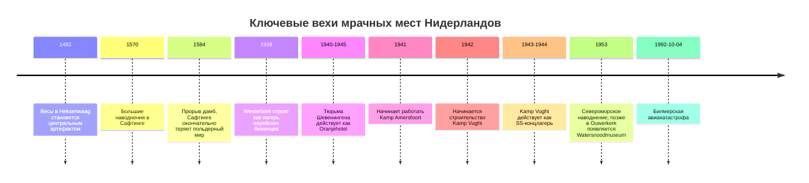

# Необычные, визуально яркие и мрачные места Нидерландов

## Исполнительное резюме

Если нужен **самый плотный и фотогеничный стрит-арт-маршрут**, то практичнее всего выбирать связки **entity["city","Амстердам","north holland, netherlands"] + entity["city","Эйндховен","north brabant, netherlands"] + entity["city","Херлен","limburg, netherlands"]**: NDSM/STRAAT даёт масштаб и музейный контекст, Berenkuil — живое легальное граффити, а Heerlen остаётся одной из самых последовательных mural-столиц страны. Для «странной» архитектуры лучший пояс — **entity["city","Роттердам","south holland, netherlands"], entity["city","Хелмонд","north brabant, netherlands"], entity["city","Хенгело","overijssel, netherlands"], entity["city","Заандам","north holland, netherlands"] и entity["city","Гронинген","groningen province, netherlands"]**, где особенно выделяются кубические дома, Kasbah, гостиница Inntel и Wall House #2. Для «тёмного» туризма наиболее содержательны и лучше всего документированы мемориальные места в **Vught, Hooghalen, Leusden, Den Haag и Ouwerkerk**, а самый атмосферный легендарный ландшафт — Saeftinghe и Solse Gat. citeturn40search1turn40search2turn5search3turn8search8turn12search12turn8search13turn9search4turn18search8turn18search5turn22search4turn17search0

Я отдавал приоритет **нидерландским официальным, муниципальным, туристическим, музейным и наследническим источникам**. Там, где официальный сниппет не показывал номер дома, точное правило фотосъёмки или жёстко фиксированные часы, я пометил это как **«не указано»**. Для стрит-арта это особенно важно: сами локальные источники напоминают, что такие объекты подвержены сносу, погоде и постоянному обновлению, поэтому финальную проверку карты лучше делать непосредственно перед поездкой. citeturn5search11turn40search6turn36search3

## Как читать подборку

В каждой таблице я собрал **редакторский топ-10**, а не «объективный национальный рейтинг». Колонка **«Источники / фото»** указывает 1–2 наиболее полезных источника; в большинстве случаев это страницы с официальными фото или галереями. Для частных жилых домов и открытых стрит-арт-стен я отдельно отмечаю, что интерьер обычно недоступен, а снимать лучше **только из публичного пространства** и без вторжения в частную жизнь. Для мемориальных и траурных мест важна не только логистика, но и уважительное поведение на месте. citeturn38search0turn26search0turn18search8

## Стрит-арт и граффити

### Сравнительная таблица

| Место | Город | Адрес / координаты | Краткое описание | Почему интересно | Советы по посещению | Источники / фото |
|---|---|---|---|---|---|---|
| entity["point_of_interest","STRAAT Museum","amsterdam, nh, netherlands"] / NDSM | entity["city","Амстердам","north holland, netherlands"] | NDSM-Plein 1, 1033 WC | Бывшая судоверфь NDSM стала крупнейшим амстердамским кластером индустриального стрит-арта. Внутри STRAAT показывают 180+ работ 170+ художников, а снаружи район продолжает жить как открытая площадка для крупноформатной уличной графики. | Лучшее сочетание «музей + свободный уличный просмотр». Хорошая база, если нужен максимально плотный визуальный опыт за полдня. | Часы музея: пн 12:00–17:00, вт–вс 10:00–17:00; в первый пятничный вечер месяца — до 21:00. Лучшие виды — с открытых площадок NDSM и вдоль воды; фото на улице свободны, для музея отдельные правила на сайте не уточнены в сниппете. | Офиц. музей и городская страница с фото citeturn40search0turn40search1 |
| entity["point_of_interest","De Berenkuil","eindhoven, nb, netherlands"] | entity["city","Эйндховен","north brabant, netherlands"] | Insulindelaan, 5624 EB | Это транспортное кольцо и подземный велоузел, где бетонные стены буквально окружены слоями граффити и стрит-арта. Пространство известно как одна из самых заметных легальных graffiti-площадок страны с постоянно меняющейся поверхностью. | Здесь лучше всего видно «живую» голландскую graffiti-культуру, а не законсервированный музейный формат. Каждый визит визуально отличается от предыдущего. | Открытое общественное пространство, наружный просмотр — фактически круглосуточно. Лучший ракурс — сверху с кольца и снизу в тоннеле; официальные спецправила фото не указаны. | VisitBrabant + urban route Eindhoven citeturn40search2turn40search12 |
| entity["point_of_interest","Hall of Fame","tilburg, nb, netherlands"] | entity["city","Тилбург","north brabant, netherlands"] | Burgemeester Brokxlaan 6, 5041 SB | Hall of Fame в Spoorzone — не просто площадка, а целая urban-culture фабрика: скейт, сцена, репетиции и стены с уличным искусством вокруг объекта. Район живёт как гибрид культурного центра и городской художественной лаборатории. | Хороший выбор, если хотите совместить стрит-арт с индустриальной атмосферой железнодорожной зоны. Это не одиночная «стена», а работающая субкультурная экосистема. | Часы свободного внешнего осмотра не указаны; для внутренних событий и площадок нужно смотреть актуальную программу. Фото снаружи обычно удобнее делать днём; на сайте есть отдельная fotopolicy. | Офиц. Hall of Fame + VisitBrabant citeturn41search0turn41search2 |
| entity["point_of_interest","Bartkira muurschildering","tilburg, nb, netherlands"] | Тилбург | Hall of Fame, Burgemeester Brokxlaan 6, 5041 SB | Огромная mural-работа **entity["people","Frans Boukas","dutch muralist"]**, установленная художником Erik Veldmeijer, висит на фасаде Hall of Fame с 2015 года. Она отсылает к интернет-проекту Bartkira и выглядит как намеренно странный гибрид массовой культуры и графической анархии. | Это одна из самых узнаваемых и локально любимых mural-работ Тилбурга. Для запроса про «визуально странные» места — почти идеальный кандидат. | Наружный просмотр — из общественного пространства Spoorzone. Лучший ракурс — немного по диагонали от фасада, чтобы работа читалась целиком; правила съёмки не указаны. | VisitBrabant + локальная street-art карта Tilburg citeturn41search9turn41search6 |
| entity["point_of_interest","Street Art Heerlen","heerlen, limburg, netherlands"] | entity["city","Херлен","limburg, netherlands"] | Старт тура: Spoorplein 40 | Херлен продвигает себя как mural-hoofdstad Нидерландов, а официальный тур ведёт по центру и объясняет истории, техники и авторов. Маршрут по городу дополняется печатной и цифровой картой, но сами объекты со временем меняются. | Лучшая отправная точка для системного знакомства со стрит-артом юга страны. Это не случайный набор стен, а полноценная городская программа. | Официальный тур — обычно в первый воскресный день месяца, 13:00–14:30; по выходным и по запросу для групп. Подходит для пешего осмотра; делайте финальную сверку маршрута перед поездкой. | Visit Zuid-Limburg + gemeente Heerlen citeturn5search6turn5search4 |
| entity["point_of_interest","Aurora","heerlen, limburg, netherlands"] | Херлен | Aurora Appartementencomplex; точный номер дома в сниппете не указан | Художественный проект **entity["organization","Boa Mistura","artist collective"]** на жилом комплексе Aurora позиционируется как крупнейшая mural-работа Европы — около 18.000 м². Важная особенность в том, что проект выполнялся совместно с жителями комплекса. | Это один из редких случаев, когда объект одновременно гигантский, жилой и социально ориентированный. Интересен не только масштабом, но и участием местного сообщества. | Наружный осмотр — с улицы; интерьер не туристический. Лучшие фото обычно получаются с дистанции, чтобы считывался весь объём комплекса; формальные photo rules не указаны. | Visit Zuid-Limburg, страница объекта citeturn5search8 |
| entity["point_of_interest","Heerlen Heron","heerlen, limburg, netherlands"] | Херлен | Mijnmuseumpad | Чёрно-белая mural-работа художников Dave de Leeuw и Vincent Lancee изображает фантастического цаплевидного персонажа на бывшем здании CBS. Она хорошо показывает, как мурaлы Херлена интегрируются в постиндустриальный городской контекст. | Это одна из самых сильных точечных работ Херлена, если нужен не маршрут, а один важный кадр. Особенно хороша для любителей больших животных/мифологических фигур на фасадах. | Наружный осмотр — свободный. Лучше приходить при рассеянном дневном свете, чтобы считывались фактура и контраст чёрно-белой росписи; спецправила съёмки не указаны. | Visit Zuid-Limburg, страница mural citeturn5search13 |
| entity["point_of_interest","Writer's Block Haniasteeg","leeuwarden, friesland, netherlands"] | entity["city","Леуварден","friesland, netherlands"] | Haniasteeg; точный номер не указан | У Writer’s Block в центре города несколько важных mural-точек; Haniasteeg официально выделяется как место работ Fake Stencils, Kenny Cookwell и Twitch. Этот проход хорош именно как «плотная» alley-локация. | Если нужен не просто один фасад, а ощущение маленького уличного пространства, наполненного краской, Haniasteeg работает лучше многих больших стен. | Доступ свободный, наружный осмотр фактически круглосуточный. Лучший режим — днём, когда переулок не проваливается в тень; правила фото не указаны. | Friesland.nl, маршрут и локации Writer’s Block citeturn6search3turn6search0 |
| entity["point_of_interest","Boekenmuur 2e Daalsedijk","utrecht, utrecht province, netherlands"] | entity["city","Утрехт","utrecht province, netherlands"] | 2e Daalsedijk 69 | Самая известная утрехтская mural-книжная полка связана с художником **entity["people","JanIsDeMan","utrecht street artist"]** и neighbourhood storytelling. Локальный маршрут по Утрехту указывает этот фасад как одну из ключевых street-art точек города. | Это не «суровое» граффити, а очень фотогеничная, дружелюбная и мгновенно узнаваемая работа. Она особенно хороша для тех, кому нравятся литературные и районные культурные коды. | Наружный осмотр — свободный. Лучше всего смотреть фронтально, с противоположной стороны улицы; формальные photo rules в локальном источнике не указаны. | Локальный маршрут Utrecht + авторская публикация citeturn7search2turn7search3 |
| entity["point_of_interest","Graffiti Hall-of-Fame Boxtel","boxtel, nb, netherlands"] | entity["city","Бокстел","north brabant, netherlands"] | Туннельная локация Tunnel Vision; точный адрес в сниппете не указан | Эта площадка выросла из Tunnel Vision graffiti jam и используется как легальная зона, где ежегодно работают десятки художников. В остальное время туннель и стены можно смотреть как открытую галерею. | Хороший контрапункт к Berenkuil: тоже legal-wall, но в более событийной и community-driven логике. | Внешний доступ — вне фестивальных дат, как правило, свободный; актуальные детали лучше сверять перед поездкой. Фото на открытой локации обычно удобнее делать в сухую погоду; спецправила не указаны. | VisitBrabant, страница локации citeturn41search15 |

Хорошая практическая логика для поездки такая: **NDSM** — для музейно-индустриального опыта, **Berenkuil** — для живого legal graffiti, **Heerlen** — для целого города-мурала, а **Tilburg / Leeuwarden / Utrecht** — для более локальных и «районных» находок. Важно помнить, что городские стрит-арт-маршруты меняются, а в самом Херлене это прямо отмечают как часть природы жанра. citeturn40search1turn40search2turn5search11turn6search0turn7search2

## Странная архитектура и архитектурные аномалии

### Сравнительная таблица

| Объект | Город | Адрес / координаты | Краткое описание | Почему интересно | Советы по посещению | Источники / фото |
|---|---|---|---|---|---|---|
| entity["point_of_interest","Kubuswoningen","rotterdam, zh, netherlands"] | entity["city","Роттердам","south holland, netherlands"] | Overblaak / рядом со станцией Blaak; точный номер музейного дома в сниппете не указан | Кубические дома, спроектированные **entity["people","Piet Blom","dutch architect"]**, стали одним из главных визуальных символов Роттердама. Жёлтые «кубы на опорах» показывают идею города как абстрактного леса из домов-«деревьев». | Это, вероятно, самый известный нидерландский пример жилой архитектурной эксцентрики. Объект одновременно странный, знаковый и все ещё городской, а не чисто музейный. | Снаружи смотреть лучше утром или ближе к вечеру, когда фасады не выбелены полуденным светом. Если хотите понять интерьер, ищите музейный Kijk-Kubus; часы внешнего осмотра не ограничены. | Rotterdam.info + City Card/R’dam info citeturn8search0turn8search4 |
| entity["point_of_interest","Kubuswoningen Helmond","helmond, nb, netherlands"] | entity["city","Хелмонд","north brabant, netherlands"] | Piet Blomplein, 5701 RE | Эти paalwoningen были экспериментом 1970-х и предшествовали более знаменитому роттердамскому варианту. Комплекс входил в композицию вокруг прежнего театра ’t Speelhuis; после пожара 2011 года контекст резко изменился, но дома остались важной частью городского наследия. | Интересны как «ранняя версия» бломовской идеи и как более редкий, менее туристический аналог Роттердама. | Это жилая зона: смотреть только снаружи и не заходить во дворы без приглашения. Лучшие кадры — с площади, где видны опоры и наклон объёмов. | Visit Helmond / Land van de Peel + Helmond heritage context citeturn12search7turn12search11 |
| entity["point_of_interest","De Kasbah","hengelo, overijssel, netherlands"] | entity["city","Хенгело","overijssel, netherlands"] | Район Kasbah; музейный адрес: Voorhof 3A, 7552 JV | Kasbah 1973 года — ещё один radical housing-проект Пита Блома, где 184 квартиры подняты на бетонных колоннах. Идея «wonen als stedelijk dak» превращает пространство под домами в полупубличную общую территорию. | Это один из самых убедительных нидерландских примеров утопического социального жилья послевоенной эпохи. Иногда кажется либо гениальным, либо намеренно некрасивым — и именно в этом его сила. | Внешний осмотр свободный; внутренние пространства — не общественный музей, если не брать отдельные активности. Лучший ракурс — чуть издали, чтобы читалась приподнятая сетка целого комплекса. | Gemeente Hengelo / RCE + Piet Blom Museum / uitinhengelo citeturn10search1turn12search12turn12search8 |
| entity["point_of_interest","Bolwoningen","s-hertogenbosch, nb, netherlands"] | entity["city","Хертогенбос","north brabant, netherlands"] | Bollenveld, Maaspoort; точный диапазон домов не указан | Сферические дома **entity["people","Dries Kreijkamp","dutch architect"]** завершили в 1984 году экспериментальную программу быстрого и дешёвого жилья. Крейкамп считал шар наиболее органичной и почти «идеальной» формой для обитания. | Визуально это, пожалуй, самый «инопланетный» жилой кластер Нидерландов. Идеальный пример дома, который для одних футуристичен, а для других откровенно нелеп. | Это жилой квартал, поэтому осматривать нужно тихо и с улицы. Лучшее время — ясный день, когда округлые поверхности дают читаемый объём и тени. | Erfgoed ’s-Hertogenbosch + Den Bosch Cultuurstad citeturn11search0turn11search4turn36search0 |
| entity["hotel","Inntel Hotels Amsterdam Zaandam","zaandam, nh, netherlands"] | entity["city","Заандам","north holland, netherlands"] | Provincialeweg 102, 1506 MD | Башня-гостиница **entity["people","Wilfried van Winden","dutch architect"]** сложена из «стопки» почти 70 традиционных заанских домиков и открылась в 2010 году. Само сочетание фольклорного силуэта и гостиничной башни превратило объект в мировой архитектурный мем. | Это один из самых известных примеров intentionally eccentric Dutch postmodern/fusion architecture. Одним он кажется остроумным, другим — архитектурной карикатурой. | Внешний осмотр свободный; если нужен необычный ракурс, берите точку немного по диагонали от станции. Внутрь можно войти как в обычный отель/ресторанный объект. | Zaans.nl + Architectuur.org citeturn8search13turn16search1turn16search0 |
| entity["point_of_interest","Glass Farm","schijndel, nb, netherlands"] | entity["city","Схейндел","north brabant, netherlands"] | Markt, Schijndel; точный номер не указан | Проект **MVRDV** увеличивает образ «среднестатистической местной фермы» в стеклянный гибрид общественного здания. Внутри — повседневные функции, а снаружи — почти призрачный образ огромного стеклянного сарая/фермы. | Это редкий объект, который одновременно выглядит как ироничный памятник сельской типологии и как высокотехнологичная архитектурная провокация. | Лучше приходить в переменную погоду: отражения и полупрозрачность тогда особенно выразительны. Доступ зависит от расположенных внутри функций; общие городские часы не указаны. | MVRDV + фоновый локальный материал о дискуссиях вокруг проекта citeturn12search1turn12search13 |
| entity["point_of_interest","Sluishuis","amsterdam, nh, netherlands"] | Амстердам | IJburg / район IJburgbaai, рядом с Haringbuisdijk и IJburglaan; точный почтовый адрес в сниппете не указан | Sluishuis — «плавающий» квартальный блок в воде, спроектированный **BIG** и Barcode Architects как современный амстердамский блок с огромным вырезом и проходом для воды. Один бок поднят, другой ступенчато спускается к городу. | Силуэт делает его одним из самых аномальных новых жилых зданий страны: одновременно мегаблок, мост, арка и пристань. | Снаружи осматривать можно свободно; интерьер жилой. Самый фотогеничный ракурс — с расстояния через воду, чтобы читался клиновидный вырез. | Gebouwd in Amsterdam + BIG / Barcode citeturn13search2turn13search0turn13search1 |
| entity["point_of_interest","Groninger Museum","groningen, groningen province, netherlands"] | entity["city","Гронинген","groningen province, netherlands"] | Museumeiland 1, 9711 ME | Современное здание музея, открытое в 1994 году, было спроектировано вокруг идеи яркой постмодернистской композиции; главным архитектором выступил **entity["people","Alessandro Mendini","italian architect"]**. Сам музей прямо признаёт, что его облик до сих пор вызывает споры о современной музейной архитектуре. | Это один из лучших примеров нидерландского здания, которое официально признаётся «поводом для дискуссии». Если вас интересует архитектура как публичный спор, объект обязателен. | Лучше смотреть и с пешеходного моста, и с набережной, чтобы увидеть составность павильонов. Часы зависят от режима музея; актуальный режим проверяйте на странице визита. | Groninger Museum, страница о здании citeturn9search4turn9search3 |
| entity["point_of_interest","Wall House #2","groningen, groningen province, netherlands"] | Гронинген | A.J. Lutulistraat 17, 9728 WT | Единственный реализованный Wall House **entity["people","John Hejduk","american architect"]** был задуман в 1973 году и построен в Гронингене в 2001-м. Огромная центральная стена с подвешенными объёмами делает дом похожим и на теоретический манифест, и на сюрреалистическую декорацию. | Это один из самых радикальных архитектурных объектов страны — скорее философская конструкция, чем «удобный дом» в обычном понимании. | В 2026 году открыт только по специальным поводам/сезонным программам, поэтому проверяйте актуальную дату до поездки. Для фотографий лучше обходить объект по периметру и смотреть его сбоку, чтобы читались подвешенные помещения. | Groninger Museum, Wall House #2 citeturn9search9turn36search1turn36search9 |
| entity["point_of_interest","De Blob","eindhoven, nb, netherlands"] | Эйндховен | Nieuwe Emmasingel 2 / 18 Septemberplein, 5611 AM–AL | Органическая стеклянно-стальная форма **entity["people","Massimiliano Fuksas","italian architect"]** была завершена в 2010 году и задумывалась как «прозрачное, соблазнительное» здание для нового торгового района. На практике объект стал демонстративным attention seeker, и даже местные источники отмечают, что часть зрителей считает его бельмом на глазу. | Это один из самых чистых примеров нидерландской love-it-or-hate-it архитектуры 2010-х. | Снаружи здание доступно постоянно; внутри работают магазины, поэтому часы зависят от арендаторов. Самый выразительный ракурс — с площади 18 Septemberplein, где видно криволинейную оболочку целиком. | This is Eindhoven + локальная архитектурная подборка citeturn15search6turn15search4 |

По совокупности странности, узнаваемости и аргументированного «почему это вообще построили» сильнейшая десятка — это **Kubuswoningen, Bolwoningen, Kasbah, Inntel, Glass Farm, Wall House #2 и De Blob**. Если хочется особенно «некрасивого/неудобного/аномального» ощущения, лучше всего работают **Bolwoningen, Kasbah и Wall House #2**; если нужен фотогеничный вау-эффект — **Inntel, Kubuswoningen и Sluishuis**. citeturn11search0turn10search1turn36search1turn16search1turn8search0turn13search2

## Мрачные места, трагедии и тёмные легенды

### Временная линия

Эта линия объединяет **документированную трагическую историю** и **долгую память места**: от раннемодерной охоты на ведьм и затопленных польдеров до лагерей Второй мировой войны и катастрофы 4 октября 1992 года в Амстердам-Зёйдосте. Для Westerbork, Vught, Kamp Amersfoort и Oranjehotel особенно важна предварительная психологическая готовность: это не «аттракционы страха», а мемориальные пространства. citeturn25search0turn26search1turn23search1turn23search3turn22search4turn23search4turn17search0turn18search6

### Сравнительная таблица

| Место | Город | Адрес / координаты | Краткое описание | Почему интересно | Доступ, безопасность, съёмка | Источники / фото |
|---|---|---|---|---|---|---|
| entity["point_of_interest","Nationaal Monument Kamp Vught","vught, nb, netherlands"] | entity["city","Вюгт","north brabant, netherlands"] | Lunettenlaan 600, 5263 NT | Единственный SS-концлагерь за пределами Германии, официально действовавший на тогдашней оккупированной территории вне рейха. Мемориал рассказывает о 32.000 историях заключённых и сохраняет аутентичный барак 1B и место казней. | Один из самых сильных и тяжёлых memorial sites страны. | Пн–пт 10:00–17:00, сб–вс и праздники 12:00–17:00; барак 1B открыт ограниченно. Фотосъёмка как чувствительная тема на таких местах требует сдержанности; спецправила в сниппете не указаны. | Офиц. мемориал и visitors info citeturn18search8turn23search4turn23search0 |
| entity["point_of_interest","Herinneringscentrum Kamp Westerbork","hooghalen, drenthe, netherlands"] | entity["city","Хогхален","drenthe, netherlands"] | Точный адрес в доступном сниппете не указан; объект расположен у Hooghalen | Westerbork начинался в 1939 году как лагерь еврейских беженцев, а затем превратился в транзитный лагерь — «ворота в ад» на пути к Auschwitz и Sobibor. На исторической территории до сих пор видны следы бывшего лагеря. | Ключевое место для понимания механики депортаций из Нидерландов. | Музей/кафе: пн–пт 10:00–17:00, выходные и праздники 11:00–17:00, 4 мая до 19:00. Место мемориальное; фото возможны, но этически лучше избегать «туристического» поведения. | Kamp Westerbork official history + visit info citeturn18search1turn18search5turn23search1 |
| entity["point_of_interest","Nationaal Monument Kamp Amersfoort","leusden, utrecht province, netherlands"] | entity["city","Лёсден","utrecht province, netherlands"] | Loes van Overeemlaan 19, 3832 RZ | Переходная тюрьма/лагерь 1941–1945 годов, откуда более 30.000 человек отправляли дальше примерно в 800 транспортировках. В подземном музее и восстановленном дворе акцент сделан и на заключённых, и на фигурах охраны. | Один из самых аналитически сильных музеев о нацистском насилии в стране. | Вт–вс 11:00–17:00, пн закрыт; в школьные каникулы с 10:00. Внешняя территория тоже важна для осмотра; маршрут лучше планировать заранее. | Kamp Amersfoort visit + exhibitions citeturn22search4turn23search6 |
| entity["point_of_interest","Nationaal Monument Oranjehotel","the hague, zh, netherlands"] | entity["city","Гаага","south holland, netherlands"] | Van Alkemadelaan 1258, 2597 BP | Так голландцы называли тюрьму в Схевенингене во время Второй мировой войны; здесь немецкий оккупант держал более 25.000 человек. Среди заключённых были участники Сопротивления, евреи, свидетели Иеговы и люди, арестованные по «экономическим» делам. | Особенно сильное место для понимания того, как обычная тюрьма становится механизмом оккупационного террора. | Посещение возможно как мемориального центра; точные часы в доступном сниппете не указаны. Это пространство памяти, а не «тёмный квест», поэтому нужен спокойный, уважительный режим посещения. | Офиц. Oranjehotel citeturn22search0turn23search3 |
| entity["point_of_interest","Watersnoodmuseum","ouwerkerk, zeeland, netherlands"] | entity["city","Оуверкерк","zeeland, netherlands"] | Weg van de Buitenlandse Pers 5 | Музей расположен в каиссонах, связанных с памятью о катастрофическом наводнении 1953 года. Экспозиции объясняют и саму катастрофу, и более широкий нидерландский опыт жизни с водой. | Лучшее место для «тёмной» водной истории Нидерландов — не хоррор, а национальная травма и инженерная память. | Ежедневно 10:00–17:00, касса закрывается в 16:15. Фотосъёмка в сниппете не регламентирована; на улице рядом есть памятное пространство. | Watersnoodmuseum official citeturn17search0turn17search6 |
| entity["point_of_interest","Groeiend Monument Bijlmerramp","amsterdam, nh, netherlands"] | Амстердам | Nellesteinpad / зона мемориала Bijlmerramp | Памятное пространство отмечает место авиакатастрофы 4 октября 1992 года, когда самолёт врезался в жилые блоки Klein Kruitberg и Groeneveen; погибло 43 человека. «Дерево, которое всё видело» стало сердцем Groeiend Monument. | Один из важнейших городских трагических мемориалов современной Нидерландов. | Это открытое общественное пространство, осмотр — свободный. Безопасность обычная городская; для фото разумно соблюдать уважительную дистанцию и не превращать мемориал в селфи-спот. | Public Art Amsterdam + Buitenkunst Amsterdam citeturn18search6turn24search4turn18search2 |
| entity["point_of_interest","Rijksmuseum de Gevangenpoort","the hague, zh, netherlands"] | Гаага | Buitenhof 33, 2513 AH | Средневековые ворота/тюрьма и музей наказаний, где показывают камеры, stockzolder, pijnkelder и историю телесных наказаний. Музей прямо выстраивает рассказ о преступлении и наказании через реальные истории этого места. | Самое «готическое» историческое пространство страны без выдуманного хоррора. | Пн 11:00–17:00, вт–пт 10:00–17:00, сб–вс 11:00–17:00. На фоне экспонатов о пытках лучше снимать деликатно; тайм-слот онлайн может быть желателен. | Gevangenpoort official citeturn19search0turn19search1turn19search3 |
| entity["point_of_interest","Museum De Heksenwaag","oudewater, utrecht province, netherlands"] | entity["city","Аудеватер","utrecht province, netherlands"] | Leeuweringerstraat 2, 3421 AC | В XVI–XVII веках сюда приезжали, чтобы «честно» взвеситься и доказать, что человек не ведьма; город получил такую привилегию от императора Карла V. Официальный музей подчёркивает: в Oudewater никого не осуждали как ведьму после такой процедуры. | Это редкое место, где тёмная история охоты на ведьм превращается не в сенсацию, а в хорошо объяснённый исторический контекст. | Обычно вт–вс 11:00–17:00; летом режим шире, зимой уже. Фото-правила в доступных сниппетах не указаны. | Heksenwaag official history + opening/contact citeturn25search0turn18search3turn18search7 |
| entity["point_of_interest","Verdronken Land van Saeftinghe","nieuw-namen, zeeland, netherlands"] | entity["city","Ньив-Намен","zeeland, netherlands"] | Emmaweg 4, 4568 PW; 51.3525139, 4.1769505 | Сегодня это крупнейший солоноватоводный марше-ландшафт Западной Европы, но в Средние века здесь стояли деревни и даже замок. Официальная история фиксирует большие наводнения 1570 и 1574 годов и окончательное разрушение польдерного мира после прорыва дамб в 1584-м. | Один из самых сильных «ландшафтов после катастрофы» в стране — и одновременно место с настоящим чувством пропажи мира. | Большая часть территории недоступна свободно именно из-за безопасности. Свободны только plankierpad и ruigelaarzenpad; при springtij маршруты уходят под воду, проверяйте погоду и tide table. | Het Zeeuwse Landschap, общая страница + история citeturn26search0turn26search1 |
| entity["point_of_interest","Het Solse Gat","drie, gelderland, netherlands"] | entity["city","Дри","gelderland, netherlands"] | Sprielderweg 205 | В Speulderbos находится легендарная «дыра», связанная с преданием о грешных монахах и ушедшем под землю монастыре; по легенде, ночью здесь слышно колокола. Современные туристические описания удерживают это как официально признанную местную сагу. | Лучший кандидат, если нужен именно «народный хоррор», а не документированная трагедия. | Открытый природный участок; лучше посещать днём и в сухую погоду. Официальные часы не детализированы; ночью ехать ради «атмосферы» не стоит из-за лесной логистики и безопасности на тропах. | Veluwe.nl, локация и легенда citeturn21search5turn21search1turn21search2 |

Для «тяжёлой» исторической линии самый сильный маршрут — **Kamp Vught → Kamp Amersfoort → Westerbork → Oranjehotel**; для **мемориала современной трагедии** — Bijlmerramp; для **исторической жути без сенсационности** — Heksenwaag и Gevangenpoort; для **ландшафтной тьмы** — Saeftinghe и Solse Gat. По реальному риску на месте самым требовательным объектом здесь является именно **Saeftinghe**, потому что официальный природоохранный источник прямо связывает ограничения доступа с безопасностью и приливами. citeturn18search8turn22search4turn18search5turn22search0turn18search6turn25search0turn19search3turn26search0

## Другие странности и причуды

### Сравнительная таблица

| Объект | Город | Адрес / координаты | Краткое описание | Почему интересно | Советы по посещению | Источники / фото |
|---|---|---|---|---|---|---|
| entity["point_of_interest","Electric Ladyland","amsterdam, nh, netherlands"] | entity["city","Амстердам","north holland, netherlands"] | Tweede Leliedwarsstraat 5, 1015 TB | Первый в мире музей флуоресцентного искусства — маленький, почти подпольный культовый объект в Jordaan. Посещение строится вокруг комнатной fluorescent environment и демонстраций минералов и объектов под разным светом. | Это почти идеальная нидерландская «странность»: малый масштаб, полная одержимость темой и непохожесть ни на что другое. | Ср–сб 14:00–18:00, **только по записи**. Внутренние photo rules на странице не прояснены; лучше заранее уточнять вместе с бронированием. | Офиц. сайт музея citeturn39search0 |
| entity["point_of_interest","Museum Vrolik","amsterdam, nh, netherlands"] | Амстердам | Meibergdreef 15, 1105 AZ | Анатомический музей при Amsterdam UMC хранит около 25.000 объектов; официально подчёркивается выставка 2.000+ предметов и сильный акцент на врождённых аномалиях, эмбриологии и истории медицины. Это место сознательно предупреждает, что не всем посетителям будет комфортно. | Один из самых необычных и одновременно самых этически чувствительных музеев страны. | Пн–пт 11:00–17:00. Фото и видео **запрещены**; музей объясняет это уважением к человеческим останкам и контексту коллекции. | Museum Vrolik: address/opening + photography policy citeturn37search4turn38search0turn38search2 |
| entity["point_of_interest","Museum Tot Zover","amsterdam, nh, netherlands"] | Амстердам | Kruislaan 124, 1097 GA | Голландский музей о смерти, траурной культуре и меняющихся ритуалах прощания расположен на территории De Nieuwe Ooster. Его коллекция соединяет исторические funerary objects и современное художественное осмысление смерти. | Это один из самых интеллигентных «мрачноватых, но не сенсационных» музеев в стране. | Вт–вс 11:00–17:00. Находится на территории мемориального парка, так что стоит оставлять время и на прогулку по окружению. | Tot Zover official + tickets/hours citeturn27search5turn35search17turn35search12 |
| entity["point_of_interest","ARTIS-Micropia","amsterdam, nh, netherlands"] | Амстердам | Plantage Kerklaan 38–40 | Micropia позиционируется как первый и единственный музей, целиком посвящённый микробам. Это делает невидимое — бактерии, грибы, микробиом — главным героем музейного опыта. | Формально это наука, но по эффекту — очень «странный» музей: вы приходите смотреть на то, что обычно невозможно увидеть. | Ежедневно 10:00–17:00. Фотоправила в сниппетах не указаны, поэтому перед съёмкой лучше свериться с правилами ARTIS. | ARTIS / Micropia official citeturn31search0turn31search1turn31search2 |
| entity["point_of_interest","Waterloopbos","marknesse, flevoland, netherlands"] | entity["city","Маркнессе","flevoland, netherlands"] | Voorsterweg 36, 8316 PT | Бывшая открытая экспериментальная площадка Waterloopkundig Laboratorium сегодня выглядит как лес, в котором природа медленно поглощает масштабные водные модели, шлюзы, каналы и тестовые бассейны. Здесь испытывали и Deltawerken, и гавани Роттердама, Лагоса, Стамбула и Бангкока. | Это один из самых сильных abandoned-ish ландшафтов Нидерландов: не руина ради руины, а заросшая инженерная лаборатория. | Пешие маршруты по лесу свободны; павильон и сервисы живут по собственному режиму. Лучший формат — 2–3 часа на спокойную прогулку и детали моделей. | Visit Flevoland, объект и маршруты citeturn34search1turn34search5turn34search0 |
| entity["point_of_interest","Deltawerk//","marknesse, flevoland, netherlands"] | Маркнессе | Внутри Waterloopbos; точный отдельный номер не указан | Гигантский wave-basin бывшего Delta flume преобразован художниками RAAAF и Atelier de Lyon в масштабное произведение Deltawerk//. Получился объект на границе между ландшафтной скульптурой, руиной и инженерным памятником. | Хорош для тех, кто ищет не просто «странное место», а странное место с сильным смыслом о воде и голландской инженерии. | Удобнее смотреть в составе маршрута по Waterloopbos. Как и весь лес, требует удобной обуви; отдельные photo rules не указаны. | Visit Flevoland, Deltawerk// citeturn34search7turn34search8 |
| entity["point_of_interest","Radio Kootwijk","kootwijk, gelderland, netherlands"] | entity["city","Коотвейк","gelderland, netherlands"] | Radioweg 1 | Монументальный радиокомплекс среди пустошей Veluwe использовался для дальней радиотелеграфной связи с тогдашней Нидерландской Ост-Индией и был введён в эксплуатацию в 1923 году. Сегодня он выглядит как нечто среднее между арт-деко-собором, секретной базой и декорацией к утопическому sci-fi. | Один из самых атмосферных постиндустриальных объектов страны. | Осмотр снаружи возможен, вокруг проходят официальные прогулочные маршруты; есть платная парковка. Лучший общий вид — с тропы Staatsbosbeheer, где специально отмечена фототочка. | Staatsbosbeheer + Veluwe.nl citeturn33search1turn33search5turn33search0 |
| entity["point_of_interest","Santa Claus","rotterdam, zh, netherlands"] | entity["city","Роттердам","south holland, netherlands"] | Eendrachtsplein, 3012 LA | Бронзовая скульптура **entity["people","Paul McCarthy","american artist"]**, более известная как “Buttplug Gnome”, соединяет рождественский образ с откровенно неудобным силуэтом и критикой потребления. Она давно стала одной из самых фотографируемых уличных странностей Роттердама. | Почти эталонная bizarre sculpture: грубоватая, спорная и немедленно узнаваемая. | Открытое городское пространство, доступ круглосуточный. Для фото лучше приходить вне пиковой толпы и помнить, что это всё же обычная городская площадь. | Rotterdam.info official citeturn28search2turn28search4 |
| entity["point_of_interest","Exposure","lelystad, flevoland, netherlands"] | entity["city","Лелистад","flevoland, netherlands"] | Strekdam, 8242 PA | Почти 26-метровый crouching man **entity["people","Antony Gormley","british sculptor"]** смотрит на Markermeer с волнолома Bataviahaven. Силуэт собран из 1.800 металлических элементов и читается то как гигант, то как призрак. | Лучшая большая открытая скульптура для запросов в стиле «бизаррное, но не китч». | Осмотр снаружи свободный. Лучшие кадры — с дистанции, когда фигура отделяется от воды и горизонта; погодозависимость очень сильная. | Visit Flevoland citeturn32search2turn32search10turn32search5 |
| entity["point_of_interest","De Groene Kathedraal","almere, flevoland, netherlands"] | entity["city","Алмере","flevoland, netherlands"] | Kathedralenpad, 1349 CX | Ландшафтная работа **entity["people","Marinus Boezem","dutch artist"]** воспроизводит план собора Нотр-Дам в Реймсе с помощью 178 тополей и бетонных дорожек. Это буквально «катедраль без камня», растущая в польдерном ландшафте. | Один из самых голландских примеров странности: одновременно conceptual art, ландшафт и тихий spiritual spoof. | Наружный осмотр — свободный; лучше идти в сухую погоду и с запасом времени на прогулку по Kathedralenbos. | Visit Flevoland, объект и маршрут citeturn35search0turn35search2turn35search4 |

В этой категории особенно хорошо работают три разные интонации нидерландской странности: **малые специализированные музеи** вроде Electric Ladyland и Vrolik, **полу-заброшенные инженерные/постиндустриальные ландшафты** вроде Waterloopbos и Radio Kootwijk и **большие уличные скульптуры/land art** вроде Exposure, Santa Claus и Groene Kathedraal. Если выбирать один «самый странный музей», я бы поставил **Museum Vrolik**; если один «самый странный ландшафт» — **Waterloopbos**; если один «самый странный объект под открытым небом» — **Santa Claus** или **Exposure**, в зависимости от того, нужен ли вам китчевый шок или суровая монументальность. citeturn38search0turn34search1turn33search5turn28search2turn32search2

## Ограничения и оговорки

Для части объектов официальный сниппет **не показывал точный номер дома, жёстко зафиксированное photo policy или полный график**, поэтому я прямо оставлял такие поля как **«не указано»**. Это чаще всего касается: городских стрит-арт-маршрутов, частных жилых архитектурных объектов и некоторых открытых скульптурных/ландшафтных мест. Кроме того, стрит-арт особенно подвижен: локальные источники по Херлену прямо отмечают, что карта требует обновлений из-за сноса, износа и погодного воздействия. citeturn5search11turn40search6turn38search0

Самые чувствительные для посещения категории — **мемориалы Второй мировой войны**, **анатомические коллекции** и **приливные ландшафты Saeftinghe**. Там важнее всего не фотогеничность, а этика поведения, актуальная проверка режима и трезвая оценка собственных границ. citeturn18search8turn18search5turn38search2turn26search0